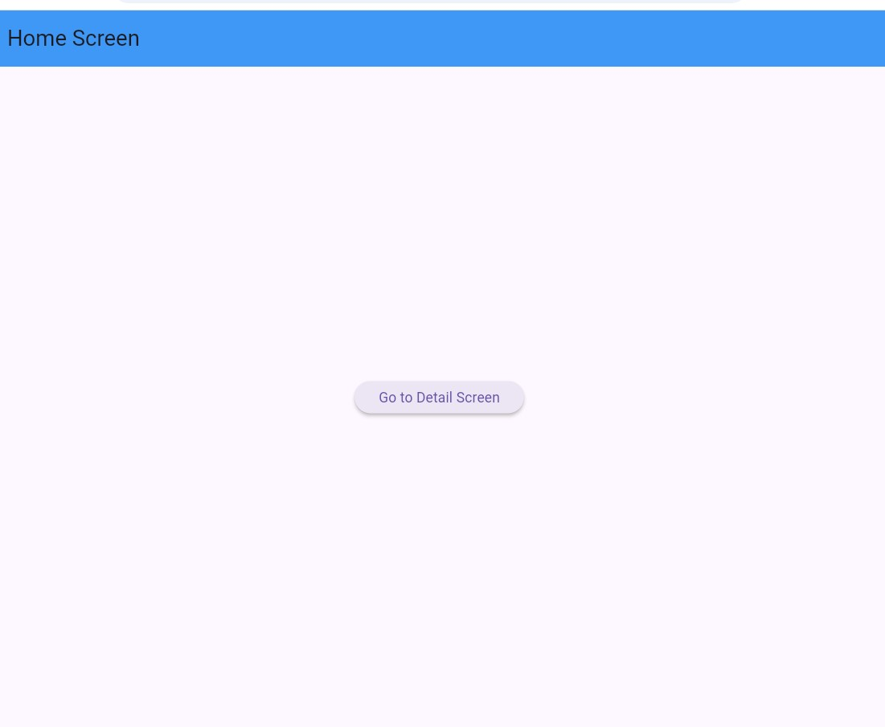
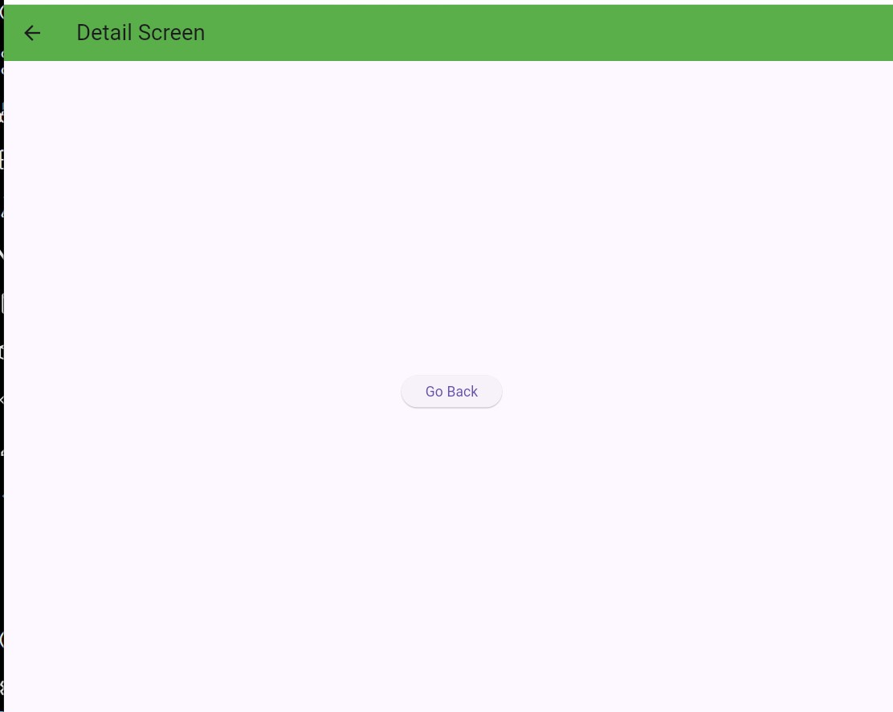

# Basic Stack Navigation Exercise

هذا المشروع هو تطبيق عملي لمفهوم "المكدس" (Stack) في التنقل بين شاشات تطبيقات الموبايل باستخدام إطار عمل Flutter. تم تطويره كجزء من المتطلبات الأكاديمية لمادة تطبيقات الموبايل.

## بيانات الطالب
**الاسم:** أسامة عبدالجليل حمود أحمد  
**القسم:** تقنية المعلومات (IT)  
**الكلية:** كلية الهندسة وتكنولوجيا المعلومات - جامعة تعز

## وصف المشروع
يوضح التطبيق آلية عمل الـ Navigator في Flutter من خلال:
1. **HomeScreen:** تمثل قاعدة المكدس (Bottom of Stack)، وتحتوي على زر للانتقال.
2. **DetailScreen:** يتم دفعها (Push) إلى أعلى المكدس عند الانتقال.

## مخرجات التنفيذ (Screenshots)
توضح الصور التالية واجهة التطبيق وحالة التنقل بين الشاشات:

  
  

